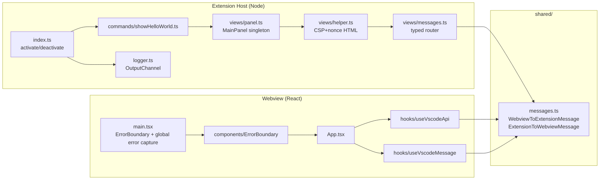
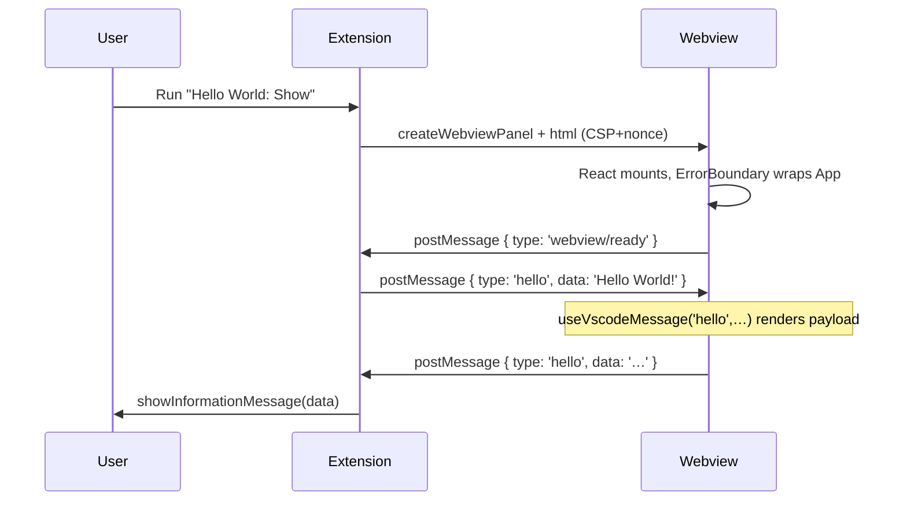

# Architecture

## Two-side structure

## Message timing

## CSP enforcement

The `helper.ts` `setupHtml` function:

1. Asks `@tomjs/vite-plugin-vscode`'s `getWebviewHtml` for the base HTML (handles dev-server vs dist resource resolution).
2. Generates a fresh nonce via `crypto.randomBytes(16).toString('base64')`.
3. Builds a CSP `<meta>` tag whose `script-src` allows only `nonce-${nonce}`. Dev mode also permits `unsafe-eval` and the dev server origin (Vite HMR requirement).
4. Injects the meta tag as the first `<head>` child and adds `nonce="…"` to every `<script>` tag.

`createWebviewPanel` is called with `localResourceRoots: [Uri.joinPath(ctx.extensionUri, 'dist')]` in production, and `undefined` (no restriction) in dev so the dev server origin works.

## Adding a new message variant

1. Add the variant to `shared/messages.ts`.
2. TypeScript flags every consumer that doesn't yet handle it.
3. Add a handler in `extension/views/messages.ts` (extension→…) or in a `useVscodeMessage('new-type', …)` call (extension→webview→component).
4. Done.

The contract is the only place that needs to be touched twice; everything else flows from there.

## Handshake

`main.tsx` posts `{ type: 'webview/ready' }` via `queueMicrotask` after the React tree mounts. `panel.ts` owns a dedicated `onDidReceiveMessage` listener for that single event, replying with the initial `hello` payload. The general router (`messages.ts`) handles every other message type. This split keeps `messages.ts` free of any `MainPanel` import and avoids the cycle `messages.ts → panel.ts → helper.ts → messages.ts`.

## State persistence

Two layers, both driven by `useVscodeApi`:

- **Per-session (webview-only).** `api.setState({ ... })` / `api.getState()`. The webview's serialized state survives panel reload and editor close/reopen as long as VSCode keeps the panel state alive.
- **Cross-session, extension-owned.** Use `context.workspaceState` / `context.globalState` on the extension side. Push to the webview via a typed message (e.g., `state/restore`) on `webview/ready`.

The starter's `App.tsx` demonstrates the per-session layer; the cross-session layer is left to the consumer.
