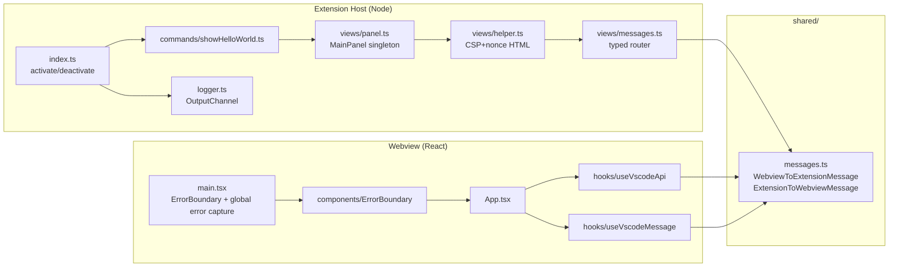
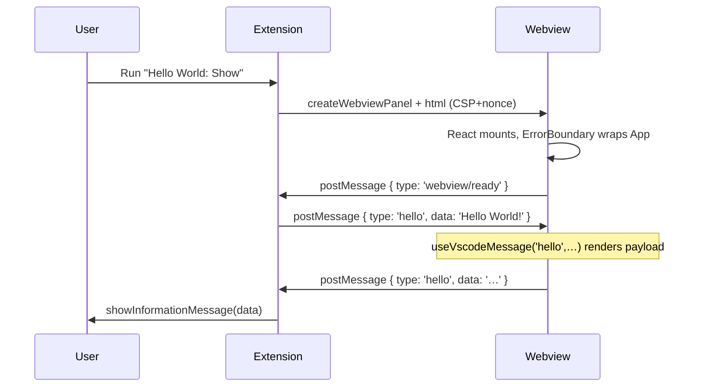

# Phase 4 — Template + Marketplace + Docs Implementation Plan

> **For agentic workers:** REQUIRED SUB-SKILL: Use superpowers:subagent-driven-development (recommended) or superpowers:executing-plans to implement this plan task-by-task. Steps use checkbox (`- [ ]`) syntax for tracking.

**Goal:** Make the template adoptable: a one-shot `pnpm init:template` script replaces every hard-coded value; Marketplace metadata is complete; documentation covers architecture, publishing, and adding commands; release flow is driven by changesets; everything is verified via an end-to-end "fresh clone → working extension" smoke test.

**Architecture:** Most of Phase 4 is content (docs) and metadata (package.json). The single piece of executable code is `scripts/init-template.mjs`, written in plain Node (no extra deps), self-contained, idempotent, and self-deleting. Release flow shifts from manual tag-driven to changesets-driven, with the existing manual `pnpm package` retained as an escape hatch.

**Tech Stack:** `node:readline/promises`, `node:fs/promises`, `node:crypto`, `@changesets/cli`, `changesets/action` GitHub Action.

---

## Spec reference

Implements §16.4 (Phase 4 DoD), §13, §14, §15 of `docs/superpowers/specs/2026-04-26-vscode-extension-template-hardening-design.md`.

## File map

| Path | Action | Purpose |
|---|---|---|
| `scripts/init-template.mjs` | Create | Interactive/non-interactive template adoption |
| `package.json` | Modify | Marketplace metadata (categories, keywords, icon, galleryBanner, extensionKind, capabilities, files); `init:template` script; changesets version script |
| `assets/icon.png` | Create | 128×128 placeholder |
| `SECURITY.md` | Create | Vulnerability reporting policy |
| `.github/CODEOWNERS` | Create | Default ownership |
| `docs/architecture.md` | Create | Module graph + message timing + CSP enforcement |
| `docs/publishing.md` | Create | Marketplace publishing + changesets cycle |
| `docs/adding-commands.md` | Create | Step-by-step new-command walkthrough |
| `README.md` | Modify | Rewritten Features, accurate component list, Publishing/Adding sections |
| `CHANGELOG.md` | Modify | Reset Unreleased; drop stale 0.0.1 block |
| `CONTRIBUTING.md` | Modify | Node ≥20; messaging contract notes |
| `.changeset/config.json` | Create | Changesets config |
| `.changeset/README.md` | Create | Standard changesets readme |
| `.github/workflows/release.yml` | Modify | Changesets-driven; supersedes Phase 3 Task 6 |

---

### Task 1: Marketplace metadata in `package.json`

**Files:** Modify `package.json`.

- [ ] **Step 1: Add metadata fields**

Update the top-level fields and add new ones (preserve all existing entries unrelated to this task — only the listed fields change):

```jsonc
{
  // existing: publisher, name, displayName, description, version, license, homepage, repository, bugs, main, engines, activationEvents, contributes — keep as-is.

  "displayName": "VSCode Extension Quick Starter",
  "icon": "assets/icon.png",
  "categories": ["Other"],
  "keywords": ["react", "shadcn", "tailwind", "webview", "starter", "template"],
  "galleryBanner": { "color": "#1e1e1e", "theme": "dark" },
  "qna": "marketplace",
  "extensionKind": ["ui", "workspace"],
  "capabilities": {
    "untrustedWorkspaces": {
      "supported": "limited",
      "description": "The webview reads no workspace files; safe to enable in untrusted workspaces."
    },
    "virtualWorkspaces": true
  },
  "files": ["dist", "assets/icon.png", "LICENSE", "README.md", "CHANGELOG.md"],
  "private": true
}
```

`private: true` is **deliberately retained** as a publish-safety brake. The README's Publishing section instructs users to flip it before their first `vsce publish`.

- [ ] **Step 2: Validate**

```bash
pnpm install --frozen-lockfile
node -e "const p=require('./package.json'); ['displayName','icon','categories','keywords','galleryBanner','extensionKind','capabilities','files'].forEach(k => { if (!p[k]) { console.error('missing', k); process.exit(1); } }); console.log('ok')"
```

Expected: `ok`.

- [ ] **Step 3: Commit**

```bash
git add package.json
git commit -m "feat(pkg): complete Marketplace metadata"
```

---

### Task 2: Placeholder icon

**Files:** Create `assets/icon.png` (128×128).

The icon must be a real 128×128 PNG. Generate it with whatever tool is available:

- [ ] **Step 1: Create the icon**

If you have ImageMagick:

```bash
mkdir -p assets
convert -size 128x128 xc:'#1e1e1e' \
  -gravity center -fill '#3b82f6' -font 'DejaVu-Sans-Bold' -pointsize 64 -annotate 0 'V' \
  assets/icon.png
```

If you have macOS `sips` + a starting solid color, or any image editor: produce any 128×128 PNG and save it as `assets/icon.png`. Content is unimportant — README documents this is a placeholder.

If neither is available, this Node one-liner produces a valid 128×128 solid-color PNG without external deps:

```bash
node -e '
const fs=require("fs"); const zlib=require("zlib");
const w=128,h=128; const bg=[0x1e,0x1e,0x1e,0xff];
const raw=Buffer.alloc((w*4+1)*h);
for(let y=0;y<h;y++){ raw[y*(w*4+1)]=0; for(let x=0;x<w;x++){ const o=y*(w*4+1)+1+x*4; raw[o]=bg[0]; raw[o+1]=bg[1]; raw[o+2]=bg[2]; raw[o+3]=bg[3]; } }
const sig=Buffer.from([137,80,78,71,13,10,26,10]);
const chunk=(t,d)=>{ const len=Buffer.alloc(4); len.writeUInt32BE(d.length,0); const tt=Buffer.from(t); const crc=Buffer.alloc(4); crc.writeUInt32BE(require("zlib").crc32(Buffer.concat([tt,d])),0); return Buffer.concat([len,tt,d,crc]); };
const ihdr=Buffer.alloc(13); ihdr.writeUInt32BE(w,0); ihdr.writeUInt32BE(h,4); ihdr[8]=8; ihdr[9]=6; // RGBA, 8-bit
const idat=zlib.deflateSync(raw);
fs.mkdirSync("assets",{recursive:true});
fs.writeFileSync("assets/icon.png", Buffer.concat([sig, chunk("IHDR",ihdr), chunk("IDAT",idat), chunk("IEND",Buffer.alloc(0))]));
console.log("ok");
'
```

(Note: `zlib.crc32` was added in Node 22; on Node 20 use the alternative below.)

For Node 20:

```bash
node -e '
const fs=require("fs"); const zlib=require("zlib");
const w=128,h=128; const bg=[0x1e,0x1e,0x1e,0xff];
const raw=Buffer.alloc((w*4+1)*h);
for(let y=0;y<h;y++){ raw[y*(w*4+1)]=0; for(let x=0;x<w;x++){ const o=y*(w*4+1)+1+x*4; raw[o]=bg[0]; raw[o+1]=bg[1]; raw[o+2]=bg[2]; raw[o+3]=bg[3]; } }
function crc32(buf){ let c, table=[]; for(let n=0;n<256;n++){ c=n; for(let k=0;k<8;k++) c=((c&1)?(0xedb88320^(c>>>1)):(c>>>1)); table[n]=c>>>0; } let crc=0xffffffff; for(let i=0;i<buf.length;i++) crc=(crc>>>8)^table[(crc^buf[i])&0xff]; return (crc^0xffffffff)>>>0; }
const sig=Buffer.from([137,80,78,71,13,10,26,10]);
const chunk=(t,d)=>{ const len=Buffer.alloc(4); len.writeUInt32BE(d.length,0); const tt=Buffer.from(t); const crc=Buffer.alloc(4); crc.writeUInt32BE(crc32(Buffer.concat([tt,d])),0); return Buffer.concat([len,tt,d,crc]); };
const ihdr=Buffer.alloc(13); ihdr.writeUInt32BE(w,0); ihdr.writeUInt32BE(h,4); ihdr[8]=8; ihdr[9]=6;
const idat=zlib.deflateSync(raw);
fs.mkdirSync("assets",{recursive:true});
fs.writeFileSync("assets/icon.png", Buffer.concat([sig, chunk("IHDR",ihdr), chunk("IDAT",idat), chunk("IEND",Buffer.alloc(0))]));
console.log("ok");
'
```

- [ ] **Step 2: Verify it's a valid PNG**

```bash
file assets/icon.png
```

Expected output: `assets/icon.png: PNG image data, 128 x 128, 8-bit/color RGBA, non-interlaced`.

- [ ] **Step 3: Commit**

```bash
git add assets/icon.png
git commit -m "feat(assets): placeholder 128×128 icon"
```

---

### Task 3: SECURITY.md

**Files:** Create `SECURITY.md`.

- [ ] **Step 1: Create the file**

`SECURITY.md`:

```markdown
# Security Policy

## Reporting a Vulnerability

If you find a security vulnerability in this template or in code derived from it, please **do not open a public GitHub issue**. Instead, use one of the following private channels:

- GitHub Security Advisory: <https://github.com/your-publisher/your-repo/security/advisories/new>
- Email the maintainers (replace with your address before publishing): `security@example.com`

We aim to respond within 5 business days. Please include:

- A clear description of the issue and its impact
- Steps to reproduce
- Affected versions
- Any mitigation you're already aware of

## Supported Versions

Only the latest minor release on `main` receives security fixes. Older versions may be patched on a best-effort basis.

## What this template enforces

- A strict Content Security Policy in production webview HTML, limited to `nonce-`-tagged scripts only.
- `localResourceRoots` confined to the extension's `dist/` directory.
- A typed message contract (`shared/messages.ts`) preventing untyped payloads from crossing the extension/webview boundary.

When you derive an extension from this template, please:

- Audit any `<script>`, `<iframe>`, or external network call you add against the existing CSP profile.
- Run `pnpm audit` periodically; Dependabot will open weekly grouped PRs for updates.
- Never disable `enableScripts` and re-enable it loosely — the typed hooks rely on `acquireVsCodeApi`.
```

- [ ] **Step 2: Commit**

```bash
git add SECURITY.md
git commit -m "docs: add SECURITY.md"
```

---

### Task 4: CODEOWNERS

**Files:** Create `.github/CODEOWNERS`.

- [ ] **Step 1: Create**

`.github/CODEOWNERS`:

```
* @AstroAir
```

(The init script in Task 9 replaces `@AstroAir` with the new owner.)

- [ ] **Step 2: Commit**

```bash
git add .github/CODEOWNERS
git commit -m "chore: add default CODEOWNERS"
```

---

### Task 5: `docs/architecture.md`

**Files:** Create `docs/architecture.md`.

- [ ] **Step 1: Create**

`docs/architecture.md`:

````markdown
# Architecture

## Two-side structure



## Message timing



## CSP enforcement

The `helper.ts` `setupHtml` function:

1. Asks `@tomjs/vite-plugin-vscode`'s `getWebviewHtml` for the base HTML (handles dev-server vs dist resource resolution).
2. Generates a fresh nonce via `crypto.randomBytes(16).toString('base64')`.
3. Builds a CSP `<meta>` tag whose `script-src` allows only `nonce-${nonce}`. Dev mode also permits `unsafe-eval` and the dev server origin (Vite HMR requirement).
4. Injects the meta tag as the first `<head>` child and adds `nonce="…"` to every `<script>` tag.

`createWebviewPanel` is called with `localResourceRoots: [Uri.joinPath(ctx.extensionUri, 'dist')]` in production, and `undefined` (no restriction) in dev so the dev server origin works.

## Adding a new message variant

1. Add the variant to `shared/messages.ts`.
2. TypeScript flags every consumer that doesn't yet handle it.
3. Add a handler in `extension/views/messages.ts` (extension→…) or in a `useVscodeMessage('new-type', …)` call (extension→webview→component).
4. Done.

The contract is the only place that needs to be touched twice; everything else flows from there.
````

- [ ] **Step 2: Commit**

```bash
git add docs/architecture.md
git commit -m "docs: architecture overview with mermaid diagrams"
```

---

### Task 6: `docs/publishing.md`

**Files:** Create `docs/publishing.md`.

- [ ] **Step 1: Create**

`docs/publishing.md`:

````markdown
# Publishing to the VSCode Marketplace

## One-time setup

### 1. Create a Publisher

Visit <https://marketplace.visualstudio.com/manage>, sign in with the Microsoft account you want to publish under, and create a Publisher. Note its ID (it's the "publisher" field in `package.json`).

### 2. Create a Personal Access Token (PAT)

In Azure DevOps (<https://dev.azure.com>), generate a PAT with **Marketplace → Manage** scope, valid for the lifetime you want. Save it somewhere safe.

### 3. Wire the secret

In your GitHub repository settings, add a secret named `VSCE_PAT` containing the PAT. The release workflow in `.github/workflows/release.yml` will pick it up automatically; without it, the workflow gracefully skips Marketplace publishing and only produces a GitHub Release with a `.vsix` attached.

### 4. Flip `private`

`package.json` ships with `"private": true` as a safety brake. Set it to `false` before your first publish.

## First release with changesets

This template uses [changesets](https://github.com/changesets/changesets) for versioning.

```bash
# In a feature branch with a user-facing change:
pnpm changeset
# Pick the bump type (patch/minor/major) and write a one-line summary.
git add .changeset/*.md
git commit -m "chore: add changeset for <feature>"
git push
```

When the PR is merged to `main`, the **Release Please-style** changesets bot opens a `Version Packages` PR that bumps `package.json` and updates `CHANGELOG.md`. Merging that PR creates a tag and triggers `release.yml`, which:

1. Runs `pnpm test && pnpm build && pnpm package`.
2. Creates a GitHub Release with the generated `.vsix` attached.
3. If `VSCE_PAT` is set, runs `pnpm vsce publish`.

## Manual escape hatch

If you need to publish a one-off without going through changesets:

```bash
pnpm version <patch|minor|major>
pnpm package
pnpm vsce publish --pat $VSCE_PAT
```

## Pre-release tags

Marketplace pre-releases are emitted with a separate flag:

```bash
pnpm package:pre
pnpm vsce publish --pre-release --pat $VSCE_PAT
```

## Verification checklist before publishing

- [ ] `pnpm typecheck && pnpm lint && pnpm test:all` green
- [ ] CHANGELOG.md updated (or changeset committed)
- [ ] icon.png replaced with the real product icon
- [ ] `private: false` in package.json
- [ ] README screenshots/GIFs current
- [ ] Manually installed the `.vsix` in a clean VSCode profile and verified the command + webview behavior
````

- [ ] **Step 2: Commit**

```bash
git add docs/publishing.md
git commit -m "docs: marketplace publishing + changesets workflow"
```

---

### Task 7: `docs/adding-commands.md`

**Files:** Create `docs/adding-commands.md`.

- [ ] **Step 1: Create**

`docs/adding-commands.md`:

````markdown
# Adding a New Command

The template demonstrates the pattern with `extension/commands/showHelloWorld.ts`. To add another:

## 1. Create the command file

`extension/commands/myFeature.ts`:

```ts
import { commands, window } from 'vscode';

import { logger } from '../logger';

import type { ExtensionContext } from 'vscode';

const COMMAND_ID = 'my-extension.myFeature';

export function register(context: ExtensionContext): void {
  context.subscriptions.push(
    commands.registerCommand(COMMAND_ID, async () => {
      try {
        // …command body…
        const choice = await window.showQuickPick(['Option A', 'Option B']);
        if (choice) window.showInformationMessage(`You picked ${choice}`);
      }
      catch (err) {
        logger.error('myFeature command failed', err);
        throw err;
      }
    }),
  );
}
```

## 2. Register the command in `package.json`

```jsonc
"contributes": {
  "commands": [
    { "command": "hello-world.showHelloWorld", "title": "Hello World: Show" },
    { "command": "my-extension.myFeature", "title": "My Extension: Do Thing" }
  ]
}
```

## 3. Wire it from `extension/index.ts`

```ts
import { register as registerMyFeature } from './commands/myFeature';

export function activate(context: ExtensionContext): void {
  registerShowHelloWorld(context);
  registerMyFeature(context);
}
```

## 4. (If the command communicates with the webview) Add a message variant

In `shared/messages.ts`, add a case to either union as appropriate:

```ts
export type WebviewToExtensionMessage =
  | …existing
  | { type: 'feature/run'; payload: { input: string } };
```

TypeScript will now require:

- A handler in `extension/views/messages.ts`.
- A `useVscodeMessage('feature/run', handler)` call (or a `postMessage` typed call) in the webview.

## 5. Test it

Add an integration assertion to `__tests__/extension/suite/extension.test.ts`:

```ts
it('registers the myFeature command', async () => {
  const ext = vscode.extensions.getExtension(EXTENSION_ID);
  if (ext && !ext.isActive) await ext.activate();
  const ids = await vscode.commands.getCommands(true);
  assert.ok(ids.includes('my-extension.myFeature'));
});
```

Run:

```bash
pnpm test:extension
```
````

- [ ] **Step 2: Commit**

```bash
git add docs/adding-commands.md
git commit -m "docs: add 'adding a new command' walkthrough"
```

---

### Task 8: Rewrite README

**Files:** Modify `README.md`.

- [ ] **Step 1: Replace contents**

`README.md`:

````markdown
# VSCode Extension Quick Starter

[](https://github.com/AstroAir/vscode-extension-quick-starter/actions/workflows/ci.yml)

A minimal, opinionated VSCode extension starter built around **React 19 + shadcn/ui + Tailwind CSS v4**, with a typed extension/webview message contract, CSP-secured webviews, and a real testing pyramid out of the box.

## Highlights

- **Vite 7** unified build for both extension and webview (`@tomjs/vite-plugin-vscode`)
- **Typed message contract** in `shared/messages.ts` — both sides speak the same union
- **CSP + nonce** in production webviews; permissive dev profile for HMR
- **OutputChannel logger**; no stray `console.log` in extension code
- **Three test layers**: Vitest (unit) + `@vscode/test-electron` (extension host) + Playwright (dev + prod-preview)
- **Strict CI**: minimum permissions, Node 20+22 matrix, 3-OS build matrix, weekly Dependabot
- **changesets** drives release; `vsce publish` is a no-op until `VSCE_PAT` is wired

## Getting started

### Prerequisites

- Node.js ≥ 20
- pnpm

### Clone via degit

```bash
npx degit AstroAir/vscode-extension-quick-starter my-ext
cd my-ext
pnpm install
pnpm init:template
```

`init:template` interactively replaces every hard-coded `your-publisher`/`AstroAir`/`vscode-extension-quick-starter` value across `package.json`, README, CHANGELOG, GitHub templates, and the extension test. Run with `--dry-run` first to see exactly what will change.

### Run

```bash
pnpm dev      # Vite dev server with HMR
```

Press **F5** in VSCode to launch the Extension Development Host. Run **Hello World: Show** from the Command Palette.

### Build

```bash
pnpm build    # production build
pnpm package  # produce a .vsix
```

## Project structure

```
extension/        Node-side code: commands, views, logger
  commands/       One file per command
  views/          Panel + helper (CSP) + message router
  logger.ts       OutputChannel singleton
  index.ts        activate/deactivate
shared/           Single source of truth for the message contract
webview/          React app rendered inside the webview panel
  components/     shadcn UI + ErrorBoundary
  hooks/          useVscodeApi, useVscodeMessage
  utils/          Legacy vscode util (delegates to hook)
__tests__/        Extension-host integration tests (Mocha)
e2e/              Playwright (dev + prod-preview)
docs/             Architecture, publishing, adding-commands
scripts/          init-template.mjs
.github/          Workflows, Dependabot, CODEOWNERS, issue/PR templates
assets/           Marketplace icon (replace before publishing)
```

## Available shadcn components

`alert`, `badge`, `button`, `card`, `dialog`, `dropdown-menu`, `input`, `label`, `select`, `separator`, `skeleton`, `sonner`, `switch`, `tabs`, `textarea`, `tooltip`. Add more on demand:

```bash
pnpm dlx shadcn@latest add <component>
```

## Architecture

See [docs/architecture.md](docs/architecture.md) for module diagrams, message timing, and CSP enforcement details.

## Adding a new command

See [docs/adding-commands.md](docs/adding-commands.md).

## Publishing to the Marketplace

See [docs/publishing.md](docs/publishing.md). Note: `package.json` ships with `private: true` as a safety brake — flip it before your first `vsce publish`.

## Scripts

| Command | Description |
|---|---|
| `pnpm dev` | Vite dev server with HMR |
| `pnpm build` | Production build |
| `pnpm typecheck` | `tsc --noEmit` for both projects |
| `pnpm lint` | ESLint (`@antfu` + `@tomjs` presets) |
| `pnpm test` | Vitest unit suite |
| `pnpm test:coverage` | Vitest with v8 coverage |
| `pnpm test:extension` | Extension-host integration tests |
| `pnpm test:e2e` | Playwright (dev + prod-preview projects) |
| `pnpm test:all` | All three test layers |
| `pnpm package` | Produce `.vsix` |
| `pnpm changeset` | Add a changeset entry for the next release |
| `pnpm init:template` | One-shot template adoption (run once after cloning) |

## Testing

Unit tests live next to source under `webview/__tests__/`. Extension-host tests are in `__tests__/extension/suite/` and run inside an instance of VSCode launched by `@vscode/test-electron`. End-to-end tests in `e2e/` use Playwright with two projects: `dev` (against `pnpm dev`) and `prod-preview` (against `vite preview` of the built dist), so the production bundle's CSP and asset paths are exercised on every PR.

## License

MIT
````

- [ ] **Step 2: Verify length**

```bash
wc -l README.md
```

Expected: < 300 lines.

- [ ] **Step 3: Commit**

```bash
git add README.md
git commit -m "docs(readme): rewrite for slim component list, accurate scripts, doc links"
```

---

### Task 9: Reset CHANGELOG, fix CONTRIBUTING

**Files:** Modify `CHANGELOG.md`, `CONTRIBUTING.md`.

- [ ] **Step 1: Replace `CHANGELOG.md`**

```markdown
# Changelog

All notable changes to this project will be documented in this file.

The format is based on [Keep a Changelog](https://keepachangelog.com/en/1.1.0/),
and this project adheres to [Semantic Versioning](https://semver.org/spec/v2.0.0.html).

## [Unreleased]

### Added
- Typed extension/webview message contract (`shared/messages.ts`)
- `OutputChannel` logger
- CSP + nonce in webview HTML; `localResourceRoots` constrained to `dist/`
- `ErrorBoundary` + global error capture in webview
- `useVscodeApi` and `useVscodeMessage` hooks
- `webview/ready` handshake gating first server→client message
- Coverage thresholds for hooks/utils
- Playwright `dev` + `prod-preview` projects
- Node 20+22 test matrix; 3-OS build matrix in CI
- Weekly grouped Dependabot
- Marketplace metadata (categories, keywords, icon, galleryBanner, extensionKind, capabilities)
- `scripts/init-template.mjs` for one-shot template adoption
- `SECURITY.md`, `.github/CODEOWNERS`, `docs/{architecture,publishing,adding-commands}.md`
- changesets-driven release workflow

### Changed
- shadcn component set trimmed to 16 commonly-used components
- pre-commit hook is fast (`lint-staged`); pre-push runs `typecheck && test`
- `release.yml` skips Marketplace step gracefully when `VSCE_PAT` is unset

### Removed
- 34 unused shadcn components and their heavy deps (`recharts`, `embla-carousel-react`, `vaul`, `react-day-picker`, `cmdk`, `input-otp`, `next-themes`, `react-hook-form`, `@hookform/resolvers`, `@base-ui/react`, `zod`)
- `tsconfig.node.tsbuildinfo` from version control
- Tautology asserts in extension-host tests
```

- [ ] **Step 2: Update `CONTRIBUTING.md`** — fix Node version and add a messaging note

In `CONTRIBUTING.md`, replace the line `- Node.js >= 18` with `- Node.js >= 20`. Then under "Code Style", append:

```markdown
- When adding a new extension↔webview message, edit `shared/messages.ts` first; both sides will surface red until you wire the handlers.
- Pre-commit runs lint-staged only. Pre-push runs `typecheck && test` — if it fails, fix the underlying issue rather than bypassing with `--no-verify`.
```

- [ ] **Step 3: Commit**

```bash
git add CHANGELOG.md CONTRIBUTING.md
git commit -m "docs: reset CHANGELOG to current Unreleased; fix CONTRIBUTING"
```

---

### Task 10: Initialize changesets

**Files:** Create `.changeset/config.json`, `.changeset/README.md`. Modify `package.json` scripts.

- [ ] **Step 1: Install changesets**

```bash
pnpm add -D @changesets/cli
```

- [ ] **Step 2: Initialize**

```bash
pnpm dlx @changesets/cli init
```

This creates `.changeset/config.json` and `.changeset/README.md`. The default config is fine; tweak `access` to `public` (this is a public template) and set `baseBranch` to `main`:

`.changeset/config.json`:

```json
{
  "$schema": "https://unpkg.com/@changesets/config@3.1.1/schema.json",
  "changelog": "@changesets/cli/changelog",
  "commit": false,
  "fixed": [],
  "linked": [],
  "access": "public",
  "baseBranch": "main",
  "updateInternalDependencies": "patch",
  "ignore": []
}
```

- [ ] **Step 3: Add scripts to `package.json`**

In the `scripts` block:

```jsonc
"changeset": "changeset",
"changeset:version": "changeset version",
"changeset:status": "changeset status"
```

- [ ] **Step 4: Commit**

```bash
git add .changeset package.json pnpm-lock.yaml
git commit -m "chore: introduce changesets for release management"
```

---

### Task 11: Switch release workflow to changesets

**Files:** Modify `.github/workflows/release.yml`.

This task supersedes the Phase 3 Task 6 release.yml.

- [ ] **Step 1: Replace contents**

`.github/workflows/release.yml`:

```yaml
name: Release

on:
  push:
    branches: [main]

permissions:
  contents: write
  pull-requests: write

concurrency:
  group: release-${{ github.ref }}
  cancel-in-progress: false

jobs:
  release:
    runs-on: ubuntu-latest
    steps:
      - uses: actions/checkout@v4
        with:
          fetch-depth: 0

      - uses: pnpm/action-setup@v4
      - uses: actions/setup-node@v4
        with:
          node-version: 20
          cache: 'pnpm'

      - run: pnpm install --frozen-lockfile

      - name: Create Release Pull Request or Publish
        id: changesets
        uses: changesets/action@v1
        with:
          version: pnpm changeset:version
          publish: pnpm release:publish
        env:
          GITHUB_TOKEN: ${{ secrets.GITHUB_TOKEN }}

  publish-marketplace:
    runs-on: ubuntu-latest
    needs: release
    if: needs.release.outputs.published == 'true'
    steps:
      - uses: actions/checkout@v4
      - uses: pnpm/action-setup@v4
      - uses: actions/setup-node@v4
        with:
          node-version: 20
          cache: 'pnpm'
      - run: pnpm install --frozen-lockfile
      - run: pnpm build
      - run: pnpm package
      - name: Publish to Marketplace
        if: ${{ env.VSCE_PAT != '' }}
        env:
          VSCE_PAT: ${{ secrets.VSCE_PAT }}
        run: pnpm vsce publish --no-dependencies --pat "$VSCE_PAT"
      - name: Upload .vsix to GitHub Release
        if: ${{ env.GITHUB_TOKEN != '' }}
        env:
          GITHUB_TOKEN: ${{ secrets.GITHUB_TOKEN }}
        run: |
          TAG=$(node -p "require('./package.json').version")
          gh release upload "v${TAG}" *.vsix --clobber
```

- [ ] **Step 2: Add the `release:publish` script to `package.json`**

```jsonc
"release:publish": "pnpm build && pnpm package"
```

(`changesets/action`'s `publish` step typically runs `npm publish`. Since we don't publish to npm, we use this hook to ensure the build artifact is fresh and let the downstream `publish-marketplace` job take over for marketplace.)

- [ ] **Step 3: Commit**

```bash
git add .github/workflows/release.yml package.json
git commit -m "ci(release): changesets-driven; conditional Marketplace step"
```

---

### Task 12: Implement `scripts/init-template.mjs`

**Files:** Create `scripts/init-template.mjs`. Modify `package.json` scripts.

- [ ] **Step 1: Write the script**

`scripts/init-template.mjs`:

```js
#!/usr/bin/env node
import { createInterface } from 'node:readline/promises';
import { readFile, writeFile, rename, unlink, access } from 'node:fs/promises';
import { stdin, stdout, argv, exit } from 'node:process';
import path from 'node:path';
import { fileURLToPath } from 'node:url';

const __dirname = path.dirname(fileURLToPath(import.meta.url));
const repoRoot = path.resolve(__dirname, '..');
const breadcrumb = path.join(repoRoot, '.template-init.json');

const CURRENT = {
  publisher: 'your-publisher',
  name: 'vscode-extension-quick-starter',
  displayName: 'VSCode Extension Quick Starter',
  description: 'VSCode extension starter with React + shadcn/ui',
  ownerOrg: 'AstroAir',
  commandId: 'hello-world.showHelloWorld',
  commandTitle: 'Hello World: Show',
};

function parseFlags(argvSlice) {
  const flags = {};
  for (let i = 0; i < argvSlice.length; i++) {
    const arg = argvSlice[i];
    if (!arg.startsWith('--')) continue;
    const eq = arg.indexOf('=');
    if (eq !== -1) flags[arg.slice(2, eq)] = arg.slice(eq + 1);
    else flags[arg.slice(2)] = true;
  }
  return flags;
}

async function exists(p) {
  try { await access(p); return true; } catch { return false; }
}

async function prompt(rl, question, defaultValue) {
  const suffix = defaultValue ? ` (${defaultValue})` : '';
  const ans = (await rl.question(`? ${question}${suffix}: `)).trim();
  return ans || defaultValue || '';
}

async function gather(flags) {
  if (flags.yes) {
    return {
      publisher: flags.publisher ?? '',
      name: flags.name ?? '',
      displayName: flags.display ?? flags.displayName ?? '',
      description: flags.description ?? '',
      repoUrl: flags.repo ?? flags.repoUrl ?? '',
      author: flags.author ?? '',
      commandId: flags['command-id'] ?? `${flags.name ?? 'my-ext'}.show`,
    };
  }
  const rl = createInterface({ input: stdin, output: stdout });
  try {
    const publisher = await prompt(rl, 'Publisher ID');
    const name = await prompt(rl, 'Extension name (kebab-case)');
    const displayName = await prompt(rl, 'Display name', name);
    const description = await prompt(rl, 'Description', '');
    const repoUrl = await prompt(rl, 'Repository URL (https://github.com/.../...)');
    const author = await prompt(rl, 'Author name');
    const commandId = await prompt(rl, "Replace command ID 'hello-world.showHelloWorld' with", `${name}.show`);
    return { publisher, name, displayName, description, repoUrl, author, commandId };
  }
  finally {
    rl.close();
  }
}

function validate(values) {
  const errors = [];
  if (!values.publisher) errors.push('publisher is required');
  if (!values.name) errors.push('name is required');
  if (!/^[a-z][a-z0-9-]*$/.test(values.name)) errors.push('name must be kebab-case (lowercase, hyphens, alphanumerics)');
  if (values.repoUrl && !/^https?:\/\//.test(values.repoUrl)) errors.push('repoUrl must start with http(s)://');
  return errors;
}

function deriveOwnerFromRepo(repoUrl) {
  const m = repoUrl.match(/github\.com[/:]([^/]+)\/([^/.]+)/);
  return m ? { org: m[1], repo: m[2] } : null;
}

const FILE_REPLACERS = [
  {
    file: 'package.json',
    transform: (text, v, derived) => {
      const json = JSON.parse(text);
      json.publisher = v.publisher;
      json.name = v.name;
      json.displayName = v.displayName;
      json.description = v.description;
      if (v.repoUrl) {
        json.repository = { type: 'git', url: v.repoUrl };
        json.homepage = `${v.repoUrl}#readme`;
        json.bugs = { url: `${v.repoUrl}/issues` };
      }
      if (v.author) json.author = v.author;
      // contributes.commands rewrite
      if (json.contributes?.commands) {
        json.contributes.commands = json.contributes.commands.map(c =>
          c.command === CURRENT.commandId
            ? { ...c, command: v.commandId, title: v.commandTitle ?? `${v.displayName}: Show` }
            : c,
        );
      }
      // remove init-template script + dep
      if (json.scripts) delete json.scripts['init:template'];
      return JSON.stringify(json, null, 2) + '\n';
    },
  },
  {
    file: 'extension/commands/showHelloWorld.ts',
    transform: (text, v) => text.replaceAll(CURRENT.commandId, v.commandId),
  },
  {
    file: 'README.md',
    transform: (text, v, derived) => {
      let out = text.replaceAll(CURRENT.publisher, v.publisher);
      out = out.replaceAll(CURRENT.name, v.name);
      out = out.replaceAll(CURRENT.displayName, v.displayName);
      if (derived?.org) out = out.replaceAll(CURRENT.ownerOrg, derived.org);
      return out;
    },
  },
  {
    file: 'CHANGELOG.md',
    transform: (text, v) => text.replaceAll(CURRENT.displayName, v.displayName),
  },
  {
    file: '.github/CODEOWNERS',
    transform: (text, v, derived) => derived?.org ? text.replaceAll(`@${CURRENT.ownerOrg}`, `@${derived.org}`) : text,
  },
  {
    file: 'SECURITY.md',
    transform: (text, v, derived) => derived ? text.replaceAll('your-publisher/your-repo', `${derived.org}/${derived.repo}`) : text,
  },
  {
    file: '__tests__/extension/suite/extension.test.ts',
    transform: (text, v) => text
      .replaceAll(CURRENT.publisher, v.publisher)
      .replaceAll(CURRENT.name, v.name)
      .replaceAll(CURRENT.commandId, v.commandId),
  },
];

async function applyReplacers(values, derived, dryRun) {
  const changes = [];
  for (const { file, transform } of FILE_REPLACERS) {
    const fp = path.join(repoRoot, file);
    if (!(await exists(fp))) continue;
    const original = await readFile(fp, 'utf8');
    const updated = transform(original, values, derived);
    if (updated !== original) changes.push({ file, fp, updated });
  }
  if (dryRun) {
    console.log('\n=== Dry run — files that would change ===');
    for (const c of changes) console.log('  ✎', c.file);
    return changes;
  }
  for (const c of changes) {
    const tmp = `${c.fp}.tmp`;
    await writeFile(tmp, c.updated, 'utf8');
    await rename(tmp, c.fp);
    console.log('  ✓', c.file);
  }
  return changes;
}

async function selfDelete(dryRun) {
  if (dryRun) {
    console.log('  ✎ scripts/init-template.mjs (would delete)');
    return;
  }
  const here = fileURLToPath(import.meta.url);
  await unlink(here);
  console.log('  ✓ removed scripts/init-template.mjs');
}

async function checkAlreadyInitialized() {
  if (await exists(breadcrumb)) {
    const data = JSON.parse(await readFile(breadcrumb, 'utf8'));
    console.warn(`\n[!] This template appears to have been initialized on ${data.timestamp} for publisher "${data.publisher}".`);
    console.warn('    Re-running will overwrite that customization.');
    const rl = createInterface({ input: stdin, output: stdout });
    const answer = await rl.question('Continue? [y/N] ');
    rl.close();
    if (!/^y(es)?$/i.test(answer.trim())) {
      console.log('Aborted.');
      exit(0);
    }
  }
}

async function writeBreadcrumb(values) {
  await writeFile(breadcrumb, JSON.stringify({
    timestamp: new Date().toISOString(),
    publisher: values.publisher,
    name: values.name,
  }, null, 2) + '\n');
}

async function main() {
  const flags = parseFlags(argv.slice(2));
  const dryRun = !!flags['dry-run'];

  if (!dryRun) await checkAlreadyInitialized();

  console.log('VSCode Extension Quick Starter — template initialization\n');
  const values = await gather(flags);
  const errors = validate(values);
  if (errors.length) {
    console.error('Invalid input:');
    for (const e of errors) console.error('  -', e);
    exit(1);
  }
  const derived = values.repoUrl ? deriveOwnerFromRepo(values.repoUrl) : null;

  console.log(`\nApplying changes${dryRun ? ' (dry run)' : ''}…`);
  await applyReplacers(values, derived, dryRun);

  if (!dryRun) {
    await writeBreadcrumb(values);
    await selfDelete(false);
    console.log('\nDone. Suggested next steps:');
    console.log('  1. Review the diff: git diff');
    console.log('  2. Replace assets/icon.png with your real icon');
    console.log('  3. Set "private": false in package.json before publishing');
    console.log('  4. git add -A && git commit -m "chore: initialize from template"');
  }
}

main().catch((err) => {
  console.error(err);
  exit(1);
});
```

- [ ] **Step 2: Add the script entry**

In `package.json` `scripts`:

```jsonc
"init:template": "node scripts/init-template.mjs"
```

- [ ] **Step 3: Test in dry-run mode**

```bash
pnpm init:template --dry-run --yes --publisher=test --name=my-test --display="My Test" --description="Test" --repo=https://github.com/test/my-test --author=Tester --command-id=my-test.show
```

Expected: prints a list of files that would change, then exits without touching them. The breadcrumb file is not written.

- [ ] **Step 4: Commit (the test run is non-destructive)**

```bash
git add scripts/init-template.mjs package.json
git commit -m "feat(scripts): init-template script with dry-run + idempotency"
```

---

### Task 13: End-to-end smoke — degit → init → build → package

**Files:** none.

This is the integration verification for the entire 4-phase effort.

- [ ] **Step 1: Run degit in a tmp dir**

```bash
cd /tmp
rm -rf phase4-smoke
npx degit AstroAir/vscode-extension-quick-starter phase4-smoke
cd phase4-smoke
```

(If you've not pushed your phase-4 changes yet, substitute `npx degit /path/to/your/local/repo phase4-smoke` against the local working tree.)

- [ ] **Step 2: Install + init**

```bash
pnpm install
pnpm init:template --yes \
  --publisher=smoke-test \
  --name=smoke-test-ext \
  --display="Smoke Test" \
  --description="Phase 4 smoke" \
  --repo=https://github.com/smoke/smoke-test-ext \
  --author=Smoker \
  --command-id=smoke-test.show
```

- [ ] **Step 3: Verify the script self-deleted**

```bash
ls scripts/
```

Expected: `init-template.mjs` no longer present. `package.json` no longer has the `init:template` script.

- [ ] **Step 4: Verify replacements**

```bash
grep -rn "your-publisher\|AstroAir\|hello-world.showHelloWorld" \
  --include='*.json' --include='*.ts' --include='*.tsx' --include='*.md' --include='*.yml' .
```

Expected: zero hits.

- [ ] **Step 5: Build + package**

```bash
pnpm typecheck
pnpm test
pnpm build
pnpm package
```

Expected: a `smoke-test-ext-0.0.1.vsix` produced.

- [ ] **Step 6: Install the .vsix in a clean profile**

```bash
code --user-data-dir /tmp/phase4-vsix --install-extension smoke-test-ext-0.0.1.vsix
code --user-data-dir /tmp/phase4-vsix
```

In the new VSCode window:
- Run `Smoke Test: Show` from the Command Palette.
- Verify the webview opens and the handshake displays "Hello World!".
- Verify the message round-trip works.

Close VSCode.

- [ ] **Step 7: Cleanup**

```bash
cd ~
rm -rf /tmp/phase4-smoke /tmp/phase4-vsix
```

- [ ] **Step 8: No commit** — verification only.

---

### Task 14: Phase 4 success-metrics check

**Files:** none.

- [ ] **Step 1: node_modules size against baseline (recorded in Phase 1 Task 1)**

```bash
du -sh node_modules
```

Expected: ≤ 70% of the Phase 1 baseline.

- [ ] **Step 2: Test runtime**

```bash
time pnpm test
time pnpm test:extension
time pnpm test:e2e
```

Total expected: < 90 seconds (unit + extension + e2e together).

- [ ] **Step 3: README length**

```bash
wc -l README.md
```

Expected: ≤ 300.

- [ ] **Step 4: Net diff against `main`'s pre-Phase-1 state**

```bash
git diff --shortstat origin/main..HEAD
```

Expected: deletions > insertions (factoring in `pnpm-lock.yaml` regeneration which may dominate; check the source-only delta:

```bash
git diff --shortstat origin/main..HEAD -- ':(exclude)pnpm-lock.yaml'
```

Source-only: deletions should still exceed insertions.

- [ ] **Step 5: Tag**

```bash
git tag phase-4-complete
```

---

## Phase 4 done

Outputs:
- `pnpm init:template` adopts the template in one step (interactive or scripted)
- Marketplace metadata complete; `private: true` retained as safety brake
- 128×128 icon placeholder; SECURITY.md; CODEOWNERS
- `docs/architecture.md`, `docs/publishing.md`, `docs/adding-commands.md`
- README ≤ 300 lines, accurate component list, links into `docs/`
- CHANGELOG reset; CONTRIBUTING aligned
- changesets installed; release workflow PR-driven; Marketplace publish gated on `VSCE_PAT`
- E2E smoke verified the full clone-to-vsix path

## Final state

The four phase-complete tags (`phase-1-complete` through `phase-4-complete`) form a milestone trail. The template now satisfies the three goals from spec §1: public starter (A), Marketplace-ready (B), reference implementation (C).
